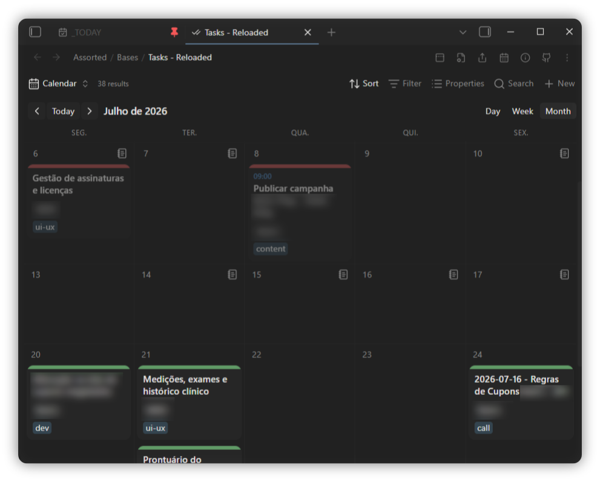
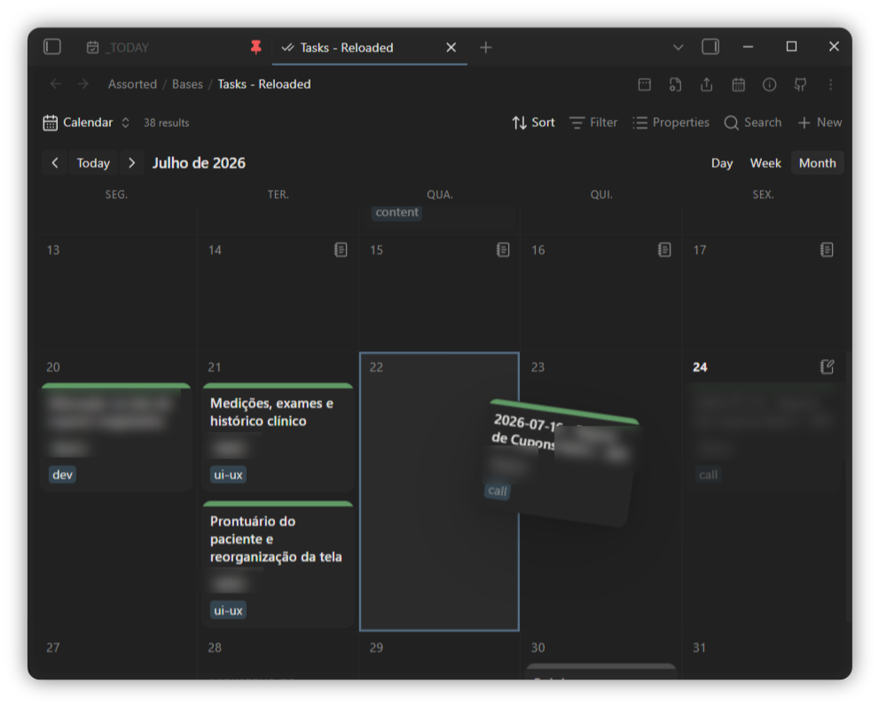
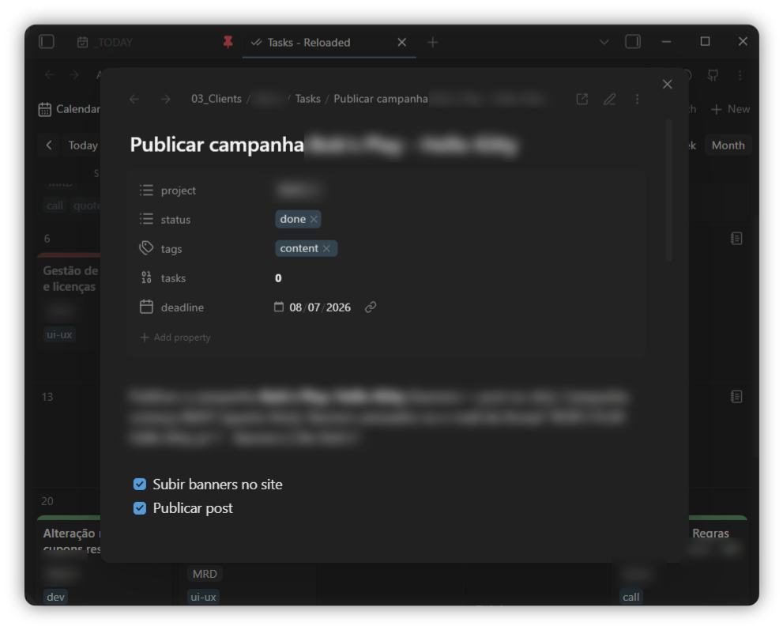

# Yabacavi

**Y**et **A**nother **BA**ses **CA**lendar **VI**ew — a calendar view for Obsidian [Bases](https://help.obsidian.md/bases).

Notes become cards on a **day, week or month** grid, placed by any date property. **Drag a card** to another day to reschedule it, and click one to open the note. Optionally, your **[Todoist](#todoist-tasks) tasks** land on the same grid beside your notes.

Requires Obsidian **1.11.4+** with the **Bases** core plugin enabled.

## Screenshots





## Features

- **Day / week / month** grid, with toolbar navigation and a *Today* button. The day
  view can span **1–7 days** side by side (a `[- +]` stepper), laid out masonry-style.
- Place notes by any **date property** — frontmatter, formula or intrinsic file date.
- **Also show undated notes by creation date** (optional, per view) — surface notes
  that have no date-property value on the day their file was created.
- Cards show whichever properties you made visible in the base, so a calendar and a
  table over the same base stay in sync. Formula properties render through Bases, so
  `html()` in a formula works on a card the same as in a table.
- **Drag & drop to reschedule** — drop a card on another day to rewrite its date
  property. The time of day and any timezone offset are preserved; a date-only
  property stays date-only. The dragged card follows the cursor and swings from
  the point you grabbed it.
- **Status → accent colour** — map a property's values (e.g. `todo`, `done`) to a
  coloured accent bar, from the settings tab.
- **Adjustable cards** — set the accent-bar thickness and the title, time and
  property-pill font sizes from the settings tab.
- **Todoist tasks on the calendar** — show your Todoist tasks beside your notes,
  filter them with a Todoist query, optionally include completed tasks, drag them
  to reschedule, and complete them from the card. See [Todoist tasks](#todoist-tasks).
- **Open notes** in a floating modal, the current tab, a new tab or a split.
- **Double-click an empty day** to create a note dated to it, optionally from a
  template file.
- **Hover** a card for the normal page preview; **right-click** for the file menu.
  **Ctrl/cmd-click** a card opens a new tab, **shift-click** opens a split.
- Show or hide **weekends**; choose the **week start**.

> Drag & drop uses the browser's native drag, which doesn't fire on touch, so
> rescheduling is desktop-only. Viewing, opening and creating notes work on mobile.

## Usage

1. Open or create a `.base` file.
2. Add a view and pick **Calendar cards** as its type (or set `type: calendar-cards`
   in the view's YAML).
3. In the view options, choose a **Date property** — nothing renders until you do.
4. Cards display the properties in the base's visible-property list, same as a table.

## View options (per view, in the base)

| Option | What it does |
| --- | --- |
| Date property | Which property places the note on the grid. Required. |
| Range | Day, week or month. The toolbar buttons write the same setting. |
| Days shown (Day range) | How many days (1–7) the day view shows side by side. The toolbar `[- +]` stepper writes the same setting. |
| Week starts on | Sunday or Monday. |
| Show weekends | When off, Saturday/Sunday are hidden for a 5-column grid. |
| Also show notes by creation date | Place notes that have no date-property value on their file's creation day (read-only). |
| Show time on cards | Show the time when the date has one. |
| Day view card width | Width of the masonry cards in the day view. |

## Plugin settings (global)

| Setting | What it does |
| --- | --- |
| Open notes in | Floating modal, current tab, new tab or split — for clicking a card and for new notes. |
| New note template | Template file copied into notes created from the calendar (raw copy; template variables aren't expanded). |
| Accent bar thickness | Height in px of each card's accent bar (0 hides it). |
| Card font sizes | Scale the card title, time and property-pill text, as a percentage of the default. |
| Status property | Frontmatter property whose value selects the accent colour. |
| Status colours | Map status values to accent-bar colours, each with its own opacity. |
| Todoist API token | Your Todoist token, kept in Obsidian's secret storage (not the settings file). |
| Show Todoist tasks | Place your Todoist tasks on the grid by their due date. |
| Todoist filter | Restrict tasks to a Todoist filter query (their own syntax); empty shows all. |
| Show completed tasks (Beta) | Also place completed tasks on their due day, styled like a `done` note. |
| Todoist auto-refresh | How often to re-fetch tasks — manual only, or every 5/15/30/60 minutes. |
| Todoist accent colour | One accent-bar colour (with opacity) for all Todoist cards; off tints them by priority. |

## Todoist tasks

Show your [Todoist](https://todoist.com) tasks on the calendar alongside your notes,
placed by their due date.

1. In *Settings → Yabacavi → Todoist*, paste your **API token** (in Todoist:
   *Settings → Integrations → Developer*). It's stored in Obsidian's secret storage,
   not in the plugin's settings file.
2. Turn on **Show Todoist tasks** — from the settings tab, or the toggle that appears
   in the calendar toolbar.
3. Tasks load when you enable them and on the toolbar **↻** button; set an
   **auto-refresh** interval for a timed re-fetch.

- Task cards carry a red **Todoist mark**, show their **project** and **labels**, and
  flag whether the task has a **description**.
- **Click** a task for a modal with its description (rendered as markdown), full due
  date, and a button to open it in the Todoist app (falling back to the web). Tick the
  checkbox by the title to **complete** the task.
- **Drag a task** to another day to reschedule it in Todoist — a timed task keeps its
  time. Recurring tasks aren't draggable, so their recurrence is never flattened.
- **Filter** which tasks appear with a Todoist filter query in settings (e.g.
  `#Work | #Personal`, `@label`) — the same syntax as Todoist's own filters.
- **Completed tasks (Beta)** — optionally show completed tasks on their due day,
  styled like a note with status `done` (and not draggable). They're fetched per
  visible month and cached, so browsing months stays light on the Todoist API.
- The accent bar is tinted by **priority** (p1 red … p3 blue) unless you set a single
  **custom accent colour** in settings.
- Tasks and notes **sort together** within a day: timed first (chronological), then
  the rest alphabetically by title.

> The Todoist integration needs Obsidian **1.11.4+** for its secret storage. Leave the
> token empty and nothing Todoist-related appears — the calendar works on its own.

## Commands

With a Todoist token set up, these show in the command palette and can be bound to
hotkeys:

- **Refresh Todoist tasks** — re-fetch now (same as the toolbar **↻**).
- **Toggle Todoist tasks** — show or hide Todoist tasks.
- **Toggle completed Todoist tasks** — show or hide completed tasks.

## Customising with CSS

Every card mirrors its note's frontmatter as `data-*` attributes and exposes a few
CSS variables, so a theme or snippet can restyle cards freely:

```css
/* colour the accent bar by status */
.yabacavi-card[data-status="done"]  { --yabacavi-accent-color: var(--color-green); }
.yabacavi-card[data-status="doing"] { --yabacavi-accent-color: var(--color-yellow); }

/* fade completed cards */
.yabacavi-card[data-status="done"] { opacity: 0.5; }
```

Handy hooks:

- `[data-<property>="…"]` on each card, from the note's frontmatter (`[data-status]`,
  `[data-project]`, …). List values match with `~=`.
- `--yabacavi-accent-color` on `.yabacavi-card`; `--yabacavi-accent-width`, the
  `--yabacavi-title-scale` / `--yabacavi-time-scale` / `--yabacavi-pill-scale` font
  scales, and `--yabacavi-day-card-width` on `.yabacavi` (the settings and view
  options write these — override them for finer control).
- `--yabacavi-day-min-height` on `.yabacavi`.
- `.yabacavi-card--todoist` for Todoist cards, with `[data-priority="1"…"4"]` and
  `[data-recurring]` to target them (their project/labels are in
  `[data-property="todoist.project"]` / `[data-property="todoist.tags"]`).
- Completed Todoist cards carry `[data-completed]` and `[data-status="done"]`, so the
  rules that style your `done` notes style them too.
- Notes placed by their creation date carry `[data-placed-by="created"]` (read-only,
  not draggable).

Status colours set in the settings tab are applied inline, so they win over CSS
rules; leave the list empty to drive the accent entirely from your own CSS.

## Install (Community plugins)

Once the plugin is in the directory:

1. Open *Settings → Community plugins* and turn off **Restricted mode**.
2. Click **Browse**, search for **Yabacavi**, open its page.
3. Click **Install**, then **Enable**.

## Install (BRAT — before it's in the directory)

With [BRAT](https://github.com/TfTHacker/obsidian42-brat):

1. Install and enable **BRAT** from *Settings → Community plugins → Browse*.
2. Run **BRAT: Add a beta plugin for testing** from the command palette.
3. Paste the repository URL:
   ```
   https://github.com/xupisco/obsidian-yabacavi
   ```
4. Confirm — BRAT installs the latest release and keeps it updated.
5. Enable **Yabacavi** in *Settings → Community plugins*.

## Install (manual / development)

```bash
npm install
npm run build      # produces main.js
```

Copy `main.js`, `manifest.json` and `styles.css` into your vault at
`<vault>/.obsidian/plugins/yabacavi/`, then reload Obsidian and enable the plugin.

## Develop

```bash
npm install
npm run dev        # esbuild watch; rebuilds main.js on change
npm run build      # typecheck + production bundle
npm run lint       # typecheck + eslint (obsidianmd rules)
```

Set `OBSIDIAN_PLUGIN_DIR` to your vault's plugin folder and `npm run dev` deploys
`main.js`, `manifest.json` and `styles.css` there on every rebuild:

```bash
OBSIDIAN_PLUGIN_DIR="/path/to/Vault/.obsidian/plugins/yabacavi" npm run dev
```

## License

[MIT](LICENSE)
